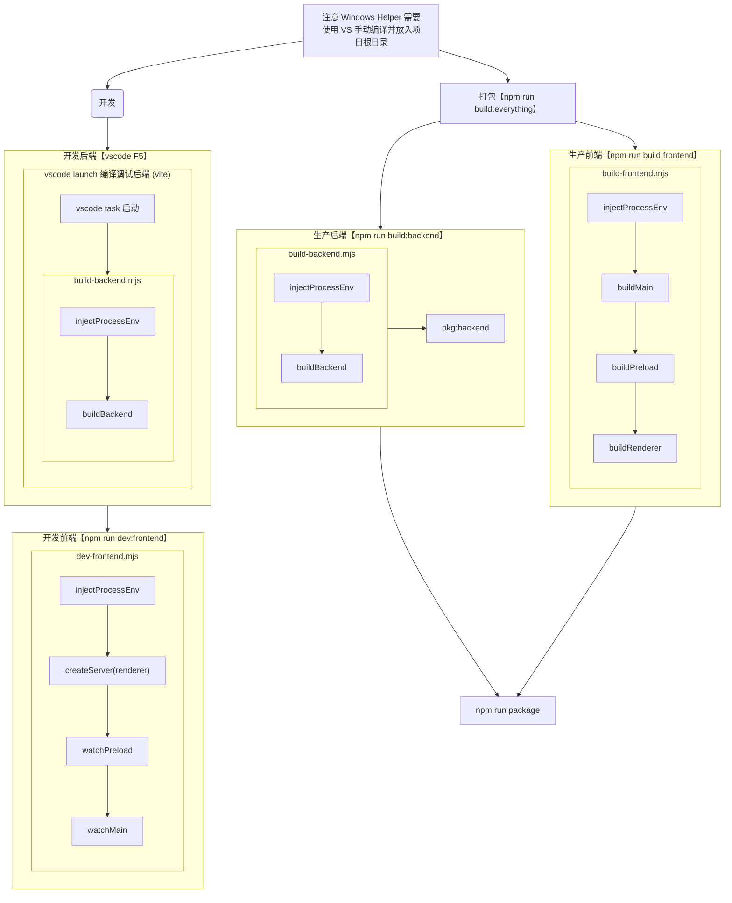

<h1 align="center">FFBox</h1>

一个多媒体转码百宝箱 / 一个 FFmpeg 的套壳

  
  
  

- 原汁原味的 FFmpeg 工作流  
  全链路支持：输入 → 滤镜 → 编码 → 输出。参数配置透明直观，对齐 FFmpeg 的原生用法。

- 所见即所得的参数生成  
  所有 FFmpeg 参数公开透明，用户通过操作界面，即能同时学习 FFmpeg 的命令。

- 自动适配本机 FFmpeg 功能  
  自动扫描并加载本机 FFmpeg 支持的全部复用器、解复用器、滤镜、编码器及其参数，尽支持尽支持。

- 预置选项 & 专业扩展  
  内置数十款常见编码器、封装格式、分辨率等参数的最佳实践与简要说明，从傻瓜式自动到高级参数随心切换。

- 高级滤镜图、多输入多输出支持  
  相比大多数软件仅支持的简单滤镜，FFBox 支持完整的流图和滤镜图编辑，可处理复杂的多输入多输出任务。
  支持扫描 FFmpeg 官网滤镜文档供用户随时参考。

- 舒适界面与自研组件库  
  自研 UI 组件库，界面细节考究，针对浅色/深色模式细致调节界面细节，视觉体验焕然一新。

- 改进的的进度与性能面板  
  图形化实时显示进度、速度、码率、剩余时间等信息，并支持以图表模式直观展示。

- 前后端分离、可部署、跨平台  
  既可直接使用 FFBox，也可单独使用 Node.js 远程转码服务 + WebUI 部署，或混搭使用。
  完整支持 Windows、Linux、macOS。支持在 Android 上部署服务。

- 任务管理系统  
  支持拖入即开始、完成即移除。
  支持单任务/全任务的启动、暂停、复制操作。
  支持自定义并发数。
  支持崩溃后保留未完成任务项。

- 更多实用功能  
  保留文件时间戳或依条件改写时间戳。
  自研开发/打包脚本，一键傻瓜式打包。
  Windows 专属支持：特制安装器、DirectX 开屏画面、任务暂停功能。

- 独创特色  
  全球独一无二的使用许可与条款！
  全球独一无二的「涩话草坪」！

详细软件介绍请访问 [FFBox 官网](http://ffbox.ttqf.tech/)。

<picture>
  <!-- 浅色模式时显示 -->
  <source srcset="https://raw.githubusercontent.com/ttqftech/FFBoxSite/refs/heads/ffboxSite-releaseCountFetcher/src/assets/%E8%BD%AF%E4%BB%B6%E6%88%AA%E5%9B%BE_%E4%B8%AD_%E6%B5%85%E8%89%B2_%E5%AE%8C%E6%95%B4.webp" media="(prefers-color-scheme: light)">
  <!-- 深色模式时显示 -->
  <source srcset="https://raw.githubusercontent.com/ttqftech/FFBoxSite/refs/heads/ffboxSite-releaseCountFetcher/src/assets/%E8%BD%AF%E4%BB%B6%E6%88%AA%E5%9B%BE_%E4%B8%AD_%E6%B7%B1%E8%89%B2_%E5%AE%8C%E6%95%B4.webp" media="(prefers-color-scheme: dark)">
  
</picture>

## 工程简介

您现在看到的是 5.x 版本的 readme 文件。FFBox 在不同的大版本之间，使用的技术/框架存在区别。若需查阅版本对应的 readme，建议切换到对应分支。

- `1.x 版本`：经典的“html + css + js”前端三件套，没有工程化和模块化。
- `2.x 版本`：使用 vue 2 进行工程化、模块化开发。主要控制逻辑集中在状态管理器上。
- `3.x 版本`：更好的高聚低耦与工程结构，服务与 UI 分离，引入 TypeScript，支持远程控制。
- `4.x 版本`：全新界面，使用更新、更多样的技术架构，自行编写开发与打包脚本，彻底分离前后端。
- `5.x 版本`：技术和框架上与 4.x 版本大体上无异，主要在功能上改进了与 ffmpeg 的“全”适配程度。

## 准备自行编译

由于这里不是前端课堂，此处当然不会有手把手的详细指南🌚。以下会列出一些需要的东西，您可自行了解：

1. `编辑器`：推荐使用 `Visual Studio Code`，已在 `.vscode` 目录中预置了启动调试后端、插入调试主进程等相关任务。
2. `运行环境`：推荐使用 `node.js`（版本 >= 22.12），主要用于项目的编译。如有需要还可 `nvm`，使用它可以切换当前的 nodejs 版本，解决部分情况下运行不起来的问题。  
   如有需要，也可使用 `bun` 作为运行环境。您可以把它理解成安卓版鸿蒙。但目前 bun 无法用于调试。
3. `包管理器`：推荐使用 `pnpm`（推荐使用 8 版本。高版本存在 electron 安装问题，见下文）。由于 electron-builder 对 utimes 的编译存在问题，pnpm 已配置为 `node-linker=hoisted`。  
   您也可以使用 `npm` 作为包管理器，npm 的速度约慢一半。这样打出来的包体积大小会有轻微不同（哪怕删除 lock 文件拉取最新）。  
   `yarn` 和 `bun` 打出来的包目前只有前端可以交由 electron-builder 打包，后端 pkg 打出来的包不可用。
4. `Windows 上的 FFBoxHelper`：该文件已预编译好。如果您想自行编译，则需要 `Visual Studio 2022`。
5. `Windows 上的安装包`：Linux / macOS 的完整打包流程无需额外配置软件，但 Windows 上需要安装 `Inno Setup 6`，并将软件（iscc.exe）放置在环境变量中。另外，`ChineseSimplified.isl` 也需要另行准备放在该软件目录下。

## FFmpeg

本项目并不自带 FFmpeg。如果您没有 FFmpeg，那么 FFBox 只能为您展示启动命令，不能进行转码工作。您需要在 [FFmpeg 下载页面](http://ffmpeg.org/download.html) 下载 FFmpeg 后，根据 FFBox 的指示，将其放入系统路径（推荐）或程序目录中。

## 开发与打包流程

## 中国特色 404 与 408 问题

在执行 `pnpm install`、`pkg:backend`、`package` 等命令时，均需要联网下载二进制预编译文件。GitHub 的 url 在国内尤为难以访问，您可能需要依据互联网上的攻略，通过如 `pnpm set registry` `pnpm set ELECTRON_MIRROR` 等方式配置 `源` 或者 `“转发的魔法”`。

本项目已在 `.npmrc` 中配置 registry 和 ELECTRON_MIRROR。但 node.js 并不乐意将这种被广泛使用的方法制定为标准，并试图弃用它而且不提供任何补救方案。很遗憾的是，pnpm 似乎愿意遵循这种趋势，在版本升级到 >= 9 后，将不再读取 `.npmrc` 中的非官方配置项。这将导致新版的 pnpm 安装完毕后可能会无法运行 electron。
["Unknown user/project config" warnings starting in npm 11.2.0 · Issue #8153 · npm/cli](https://github.com/npm/cli/issues/8153)

### Error: Electron failed to install correctly, please delete node_modules/electron and try installing again

若您出现了此问题，可尝试以下解决方案：

1. 退回到 pnpm@^8 版本再进行安装。
2. 从执行原理来说，electron 在 postinstall 阶段会执行 install.js，调用 @electron/get 进行下载。如果这个阶段失败，可能没有错误提示。此时需要进行手动操作（仅供参考）：
2.1. 手动下载 electron，如 `electron-v24.8.8-win32-x64.zip` 并解压到 `node_modules/electron/dist`。
2.2. 创建 `node_modules/electron/path.txt`，写入 `electron.exe`。

### Cannot find module '@rolldown/binding-darwin-arm64'

参考 https://github.com/npm/cli/issues/4828 需要使用 22.12+ 版本的 node.js。
